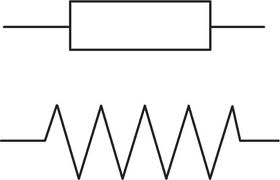
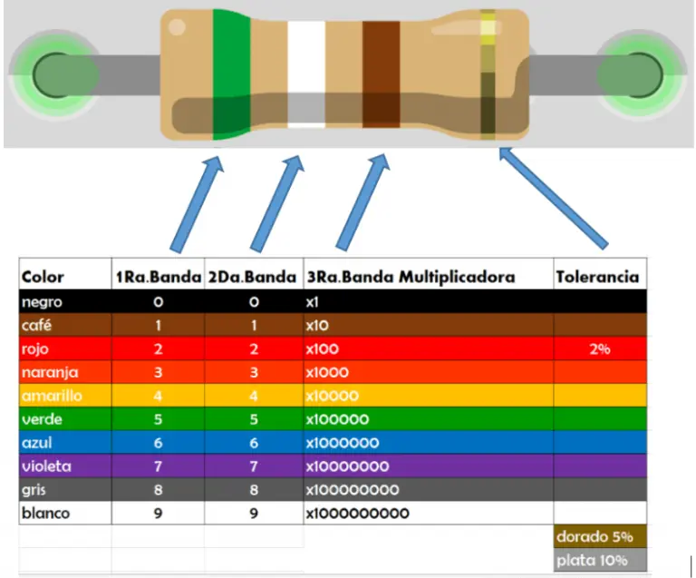
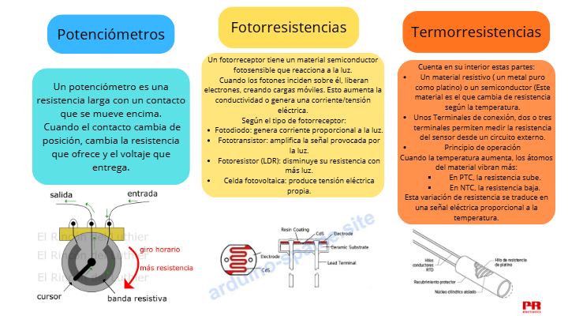
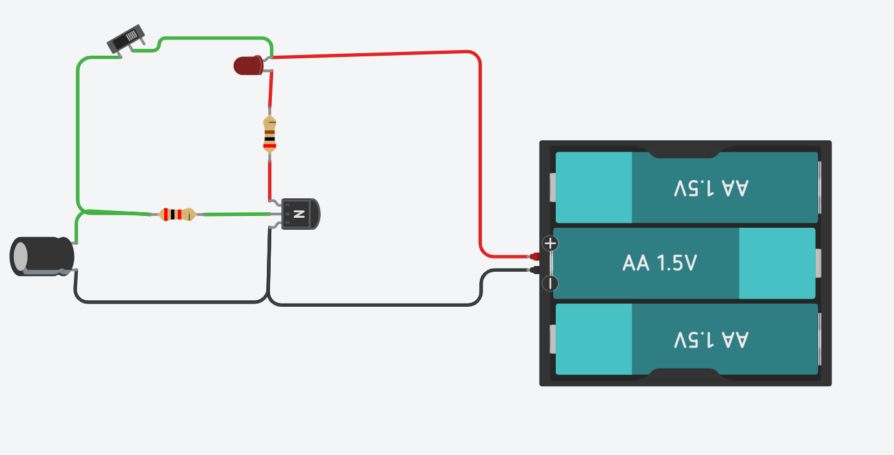
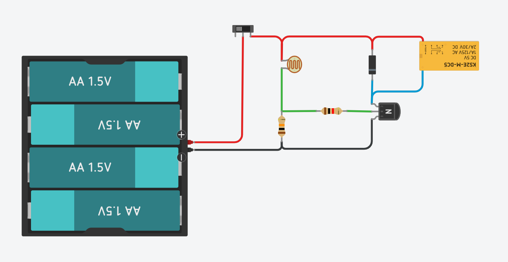
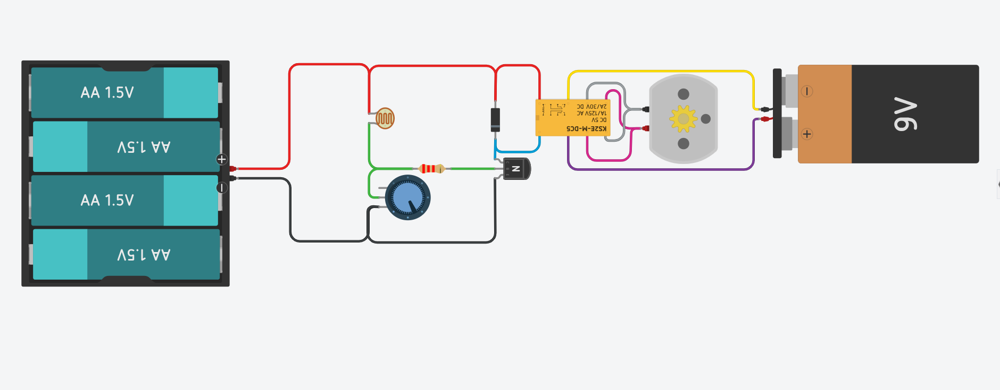
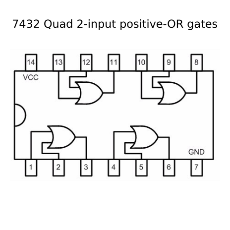
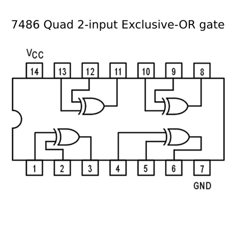

# Electrónica Básica
En este apartado vamos a ver componentes electronicos que hemos visto en clase, que pese a tener nombres raros, son más comunes de lo que creemos y rondon por nuestra vida diaria cumpliendo sus funciones, falicitando nuestras vidas aun que sea solo un poco.
# Electrónica Analógica

## 1.Resitencias fijas y variables
### 1.1 Resitencias fijas

 
 
   

**_¿Para que sirve?_**

Las resistencias fijas son resistencias cuyo valor **no podemos modificar a voluntad**. Su valor se mide en ohmios (simbolo omega) con una tabla de colores que asigna en numero de ohmios que actua la resistencia y su variación en %.
Las resitencias dificultan el paso de la corriente, consiguiendo, así, variaciones de tensión en los puntos del circuito donde sea necesario.Por ejemplo ayudan a que un componente sensible, como el LED, no se dañe por que pase demasiada corriente ya que si conectamos el LED a una bateria directamente, se quemará mientras que una resistencia fija en serie limita la corriente y proteje el LED.

***Funcionamiento interno***

Las resistencias fijas funcionan porque dentro tienen un material resistiente al paso de la corriente, como es el carbón,el metal o el hilo, que opone el paso de la corriente.La resistencia depende de la longitud, el grosor y el tipo de material por eso las resistencias más potentes tienen mayor tamaño. Al pasar corriente, parte de la energía se convierte en calor, y el valor de la resistencia se mantiene constante, por eso, hay que tener cuidado al tocar una resistencia por la que pase un gran voltaje y a tocar cualquier tipo de cicuito.

***Algunas aplicaciones de uso***

Algunas de las muchas funciones que presenta este componente tan versatil son: 
+ Limitar corriente:
Una resistencia de 220 Ω en serie con un LED para que no se queme.

+ Dividir voltaje:
Dos resistencias de 10 kΩ formando un divisor para obtener 6 V a partir de 12 V.

+ "Polarizar" transistores:
Una resistencia de 4.7 kΩ en la base de un transistor NPN para controlar su conducción.

+ Circuitos temporizadores RC:
Una resistencia de 100 kΩ con un capacitor de 10 µF para formar un retardo.

+ Cargar/descargar capacitores:
Una resistencia de 1 kΩ en paralelo con un capacitor para descargarlo lentamente en una fuente.

**_Variedades_** 

Las resistencias fijas al no poder cambiar su valor a voluntad, estan indicadas mediante bandas que incluyen un codigo de colores que para interpretarlas devems de saber lo siguiente:
 
 + Las dos primeras bandas son los son los numeros que equivalen su color (mirar la tabla de abajo, "1RA Banda/ 2DA Banda")
 + Ahora añadiremos tantos ceros como indica el color de la tercera banda, es decir si es naranja (naranja=3) pondemos 3 ceros-> "000", o multiplicamos el numero por 1000 que es lo mismo.
 + Por último, la franja del final indica el margen de error o tolerancia del valor de la resistencia, es decir que depende se su color (plata 10%, dorada 5% o rojo 2% ) está indicando cuanto puede variar el valor de la resistencia, por ejemplo, si el valor de nuestra resistencia es de 110 ohmios y tenemos una franga es dorada, el 5% de 110 es 5,5 ohmios asi que su valor varía entre 104,5 ohmios y 115,5 ohmios.

 
 

### 1.2 Resitencias variables

 

***¿Para qué sirve?***

Las resistencias variables o potenciometros, a difefencia de las resistencias fijas, estos **pueden cambiar su valor a voluntad** de forma manual o dependiendo del exterior. Estan presentes normalmente en cicuitos donde tengan función de "reguladores" como son de una luz que emite una bombilla, el volumen que emite un altavoz, o de un motor para controlar su velocidad, etc.

***Funcionamiento interno***

 
 

***Algunas aplicaciones de uso***
| **Resistencias variables**  | **Aplicaciones** |
| :-------------: | :-------------: |
| Potenciómetro  | Son las ruedas en los dispositivos de sonido como las radios o altavoces para regular el sonido  |
| Fotoresistencia (LDR)   | Son usados en las lámparas de algunos jardines, se mantiene apagados cuando es de dia y se encienden por la noche|
| Resistencia NTC | Son los sensores de temperatura que tienen muchos termómetros   |
| Resistencia PTC | usados en calentadores eléctricos mantienendo la temperatura constante, por ejemplo, en calefactores o asientos calefactables.  |

***Variedades***

Existen varios tipos de resistencias variables dependiendo de como pueden ser regulados:

| **Formas de ser regulados**  | **Tipo de resistencia variable** |
| :-------------: | :-------------: |
| Manualmente  | Potenciómetro |
| Cantidad de luz del entorno   | Fotoresistencia (*Light-Depended Resistor*) |
| Cambios en la temperatura | NTC/*Negative Temperature Coefficient* (disminuye si se eleva la temp.) o PTC/*Positive Temperature Coefficient* (aumenta si se incrementa la temperatura)  |

## 2.Condensadores

 

 ***¿Para qué sirve?***
 

 
Los condensadores tienen una capacidad que es la cantidad de carga que es capaz de almacenar por cada voltio en sus extremos y se miden en **faradios** (F).
Sirven para almacenar la carga electrica y liberarla posteriormente. Cuanto mayor sea la capacidad del condersador, más carga adquidirá y más tiempo tardará en descargarse.

 

***Funcionamiento interno***

Adentro del condensador ocurren estos procesos en secuencia:
+ **Info**

El condensador tiene dos placas conductoras separadas por un material aislante llamado dieléctrico.

+ **Aplicación de voltaje**

Al conectarlo a una fuente:
Una placa acumula carga positiva.
La otra acumula carga negativa.

El dieléctrico impide que entren en contacto.

+ **Formación del campo eléctrico**

Las cargas opuestas generan un campo eléctrico entre las placas.
Ese campo es donde se almacena la energía.

+ **Carga y descarga**

Si hay voltaje el condensador se carga.

Si se conecta un circuito entre las placas se descarga, liberando la energía.

****!- Papel del dieléctrico -!****

El dieléctrico tiene 3 funciones igual de importantes que son:

-Aumenta la capacidad de almacenamiento.

-Evita cortocircuitos.

-Permite condensadores más compactos.

***Algunas aplicaciones de uso***

Se pueden emplear los condensadores para: almacenar carga (*flashes* de las cámaras), como temporizadores de circuitos, para filtrar señales indeseadas, en cagadores de baterías, receptores de radio y televisión, pantallas táctiles,...

 

***Variedades***

Los condensadores se clasifican en función del material empreado en su fabricación y de que tengan o no polaridad.

Los condensadores **no polacizados** se fabrican de papel, con material cerámico o de poliéster.
Mientras que los condensadores **polarizados o electrolíticos** pueden ser de aluminio (Al) o de tantalio (Ta).

## 3.Diodos

 

***¿Para qué sirve?***

Los diodos se usan en la electrónica analógica para permitir que en un circuito permita el paso de la corriente por un sentido pero no por el otro, imagina la puerta de tu casa, tú desde adentro puedes abrir la puerta y pasar por ella, pero desde afuera no puedes pasar por la puerta. Pues la puerta es el diodo y tu eres uno de los muchos electrones que pasan por el cicuito

***Funcionamiento interno***

Adentro de los diodos leds se encuentra un material semiconductor llamado "unión PN" con una barrera interna, permitiendo asi que:

+ En polarización directa, la barrera baja y deja pasar corriente.
  
+ En polarización inversa, la barrera sube y bloquea la corriente.

***Algunas aplicaciones de uso***

Este comportamiento del diodo permite emplearlos para **dirigir la corriente eléctrica**, perfecto para rectificores y en elementos de protección de circuitos.

***Variedades***

Existen una variación de los diodos que son los **diodos LED** (que veremos en el siguiente apartado) y los **diodos Zener**, que permiten el paso de la corriente también en polarización inversa con una caída de tensión fija según sus caracteristicas de fabricación.

 

 

## 4.LEDs

 

***¿Para qué sirve?***

El diodo LED (*Light-Emitting Diode*) es un tipo especial de diodo qie es capaz de emitir luz cuando es atravesado por la corriente eléctrica. Debido a su bajo consumo y fácil fabricación se emplea en multitud de pilotos indicadores.

***Funcionamiento interno***

Los diodos LED tienen un voltaje y una intensidad de corriente de funcionamiento característcos según su color; si se sobrepasa dicha intensidad, se queman. Para evitar esto, se les conecta en serie una resistencia limitadora (220 ohmios). El valor de la resistencia se calcula según la ley de Ohm, restando al voltaje de la fuente el necesario para el LED y dividiendo el resultado entre la intensidad requerida:

 

Con esta tabla podemos conocer el valor del *V* (led)

| **Color**  | **Tensión umbral** |
| :---: | :---: |
| Rojo | 1,6 V |
| Rojo de alta luminosidad | 1,9 V |
| Amarillo | 1,7 V a 2 V | 
| Naranja | 2,4 V |
| Verde | 2,4 V |
| Blanco brillante | 3,4 V |
| Azul claro | 3,4 V |
| Azul | 4,6 V |

***Algunas aplicaciones de uso***

Desde el descubrimiento del LED azul ahora podemos crear la luz blanca (al unir los colores azul, rojo y verde) siendo aplicada en la fabricación de pantallas domésticas de bajo consumo. Tambien encontramos luces leds en las luces traseras de los coches.

 

***Variedades***
Los diodos LED pueden variar de colores, pero tambien de tamaños ( desde grandes como el tamaño de un pulgar o pequeños como la punta del boli) y formas ( más cuadradas, más circulares, etc)

 

## 5.Transistores

***¿Para qué sirve?***

El **transistor** es el elemento principal en los circuitos electrónicos ya que funciona como un interruptor automático, que se activa con una pequeña corriente en la base , y permite la circulación de dicha corriente entre el colector y el emisor.
Los transistores tienen tres estados disponibles (comparación con un grifo)

+ **Corte**: no hay corriente en la base y los electrones no pasan del emisor al colector, como si el grifo estuviese cerrado, no pasaría agua.
+ **Amplificación**: una pequeña corriente pasa por la base, como si el grifo enstuvierra entreabierto, pasa agua pero no toda la que puede dar.
+ **Saturación**: Cuando en el transistor está en su maximo esplendor, pasando toda la corriente que es capaz de administrar, como si un grifo estuviera a máxima potencia.

 

***Funcionamiento interno***

 

***Algunas aplicaciones de uso***

Se emplea en circuitos de control y es el componente básico de los microprocesadores y los distintos tipos de memoria que usan los ordenadores.

***Variedades***

Lostransistores puedes variar segun su polarización siendo NPN (**N**egativo **P**ositivo **N**egativo) cuando el colector recibe corriente de la base por el emisor y PNP (**P**ositivo **N**egativo **P**ositivo) cuando el 

## 6.Relés
|  | |

***¿Para qué sirve?***

 

***Funcionamiento interno***

***Algunas aplicaciones de uso***

***Variedades***

# CIRCUITOS DE FUNCIONAMIENTO
## Circuito 1
 

***Componentes:***

+ Batería de 4,5 voltios ( 3 pilas de 1,5V )
+ LED
+ Interruptor
+ 2 resistencias; de LED a transistor: 200 ohmios.Y de interruptor/condensador a transistor: 2 kiloohmios
+ Transistor NPN
+ Condensador (100 microfaradios)

***Funcionamiento:***

El funcionamiento de este circuito analógico es el de encender o apagar un LED segun el estado del interruptor y el Condensador hace de batería externa cuando el circuito no suministre corriente o accionemos el interruptor.

 
## Circuito 2
 
 
 ***Compnentes:***
 
+ Batería de 6V (4 pilas de 1,5V)
+ LDR (Fotorresistencia)
+ 2 resistencias; de LDR a base del trasnistor: 1 kiloohmio.Y de LDR a polo negativo de la batería: 10 kiloohmios
+ Diodo
+ Relé

***Funcionamiento:***

Aquí, el relé funciona gracias a el transitor que esta conectado a una LDR así que dependiendo de la luminosidad se activará o no el relé.

## Circuito 3
 

 componentes:

---

# Electrónica Digital
La electromica digital se basa en el empleo de componentes que solo admiten *dos estados*, el **0** (apagado/abierto) y el **1** (encendido/cerrado).

## PUERTAS LÓGICAS
Las **puertas lógicas** son componentes capaces de realizar operaciones sencillas con 0 y 1. Cada una de ellas, en función de los valores de salida diferente, que corresponde a una función lógica del pensamiento, es decir, que cada una tiene un razonamiento ante la infomación que recibe por su o sus entradas.
Las mas importantes son las puertas ***NOT,OR,AND,NOR,NAND y OR exclusiva ( XOR )***

### -NOT
| Simbolo puerta lógica | Disposición interna |
|---|---|
| |  |

+ ***Funciones***
En la puerta "NOT" la salida es inversa de la entrada. Si entra un 1 sale un 0 y viceversa

+ ***Tabla de Verdad***

| **a**  | **S** |
| :---: | :---: |
| 1 | 0 |
| 0 | 1 |
  
### -OR
| Simbolo puerta lógica | Disposición interna |
|---|---|
| |  |

+ ***Funciones***
La puerta "OR" presenta en su salida un 1 siempre que una de sus dos entradas o las dos adoptan el valor 1. Es decir, que necesita activada "a" **o** "b" o ambas.

+ ***Tabla de Verdad***

| **a** | **b** | **S** |
| :---: | :---: | :---: |
| 0 | 0 | 0 |
| 0 | 1 | 1 |
| 1 | 0 | 1 |
| 1 | 1 | 1 |

### AND
| Simbolo puerta lógica | Disposición interna |
|---|---|
| |  |

+ ***Funciones***
La salida de la puerta "AND" será 1 siempre que el valor de sus dos patillas sea 1. Es decir, que necesita encendida la "a" **y** "b" encendidas.

+ ***Tabla de Verdad***
  
| **a** | **b** | **S** |
| :---: | :---: | :---: |
| 0 | 0 | 0 |
| 0 | 1 | 0 |
| 1 | 0 | 0 |
| 1 | 1 | 1 |

### XOR
| Simbolo puerta lógica | Disposición interna |
|---|---|
| |  |

+ ***Funciones***
La puerta "OR exclusiva" o "XOR" es 1 cuando *cualquiera de las dos entradas sea "1" **pero no ambas a la vez***. Osea, se da, o bien "a", o bien "b".

+ ***Tabla de Verdad***

| **a** | **b** | **S** |
| :---: | :---: | :---: |
| 0 | 0 | 0 |
| 0 | 1 | 1 |
| 1 | 0 | 1 |
| 1 | 1 | 0 |

### NOR
| Simbolo puerta lógica | Disposición interna |
|---|---|
| |  |

+ ***Funciones***
La puerta "NOR" es una inversión de la puerta "OR",se da 1 en la salida cuando **no** estan activadas "a", "b" o las dos a la vez.Lo mismo sería decir que solo es 1 cuando las dos entradas valen 0.

+ ***Tabla de Verdad***

| **a** | **b** | **S** |
| :---: | :---: | :---: |
| 0 | 0 | 1 |
| 0 | 1 | 0 |
| 1 | 0 | 0 |
| 1 | 1 | 0 |

### NAND
| Simbolo puerta lógica | Disposición interna |
|---|---|
| |  |

+ ***Funciones***
Al igual que la puerta "NOR", la puerta "NAND" es una inversión de la puerta "AND",la salida tiene el valor 1 cuando está solamente encendida la entrada "a" o "b" o ninguna. Lo mismo seria decir que solo tiene valor 0 en la salida cuando en las 2 entradas ("a" y "b") presentan el valor 1.

+ ***Tabla de Verdad***

| **a** | **b** | **S** |
| :---: | :---: | :---: |
| 0 | 0 | 0 |
| 0 | 1 | 1 |
| 1 | 0 | 1 |
| 1 | 1 | 1 |

## DISEÑO DE CIRCUITOS 
El diseño de los circuitos requiere encontrar las puertas adecuadas, simplificand al máximo la expresión logica, se recurre al ***álgebra de Boole***.En ocasiones la correcta enunciación del problema permite decucir directamente la expresión.
Por ejemplo en el IES Az-zait se pretende que la calefacción se encienda en cierta sala al abrir la puerta siempre que sea de día o no haya nadie en la conserjería.
Ahora vamos a definir que sensores van a enviar señales al sistema y qué circunstrancias se van a considerar positivas y cuáles negativas.Así:

+ ***a***: el estado de la puerta lo determinará un sensor de contacto que se cierra al abrir la puerta: puerta abierta=1, puerta cerrada=0
+ ***b***: La luz será detectada por un sensor de luminosidad que mandará señales positivas cuando sea de día: día=1, noche=0
+  ***c***: L a presencia de alguien en la conserjería la indicará un sensor de movimiento: presencia=1, ausencia=0

El siguiente paso será crear una tabla de verdad con lo anterior mencionado

| **a** | **b** | **c** | **S** |
| :---: | :---: | :---: | :---: |
| 0 | 0 | 0 | 0 |
| 0 | 0 | 1 | 0 |
| 0 | 1 | 0 | 0 |
| 1 | 0 | 1 | 0 |
| 0 | 1 | 1 | 0 |
| *1* | *0* | *0* | *1* |
| *1* | *1* | *0* | *1* |
| *1* | *1* | *1* | *1* |

+ Seleccionaremos aquellas combinaciones que presenten en la salida el valor "1" y las traduciremos al lenguaje algebraico de Boole indicando las combinaciones de tal manera que sea **abc** siendo **"a"** cuando a=1 y **"-a"** (a negada) cuando a=0
En estre caso seria:

***a-b-c + ab-c + abc***

+ Ahora simplificaremos la ecuacción, haremos parejas con las combinaciones que tengan similitudes. Usaremos *"abc"* y *"ab-c"* se asemejan en que ambos tienen la entrada **"a"** y **"b"** equivalentes a 1 (a si que las dejaremos iguales), pero tenemos la **"c"** que no son iguales ya que en una c=1 y en la otra es c=0, lo que haremos será meterlo entre un parentesis y sumarlas:

***a-b-c + ab(-c+c)***

+ El siguiente paso que haremos será eliminar el parentesis ya que recoredmos que estamos trabajando con *0* y *1* por lo tanto la sma entre estos es y será siempre **1**.Ahora volveremos a simplificarlo con similitudes, en este caso ambas entradas **"a"** son tuenen el mismo valos ( *1* ), mientras que las otras entradas tienen valores diferentes, meteremos entre parentesis los valores de las entradas **"b"**, **"-b"** (o b negada y **"-c"**). A continuación haremos como en el ejemplo previo con los valores de las entradas *"c"*, pero en estre caso con las entradas *"b"* y sus respectivos valores.
¡¡PERO OJO!! no eliminaremos del completo la **b** ya que estariamos dciendo que no existen o que no las necesitamos y eso no es verdad, asi que diremos que su entrada tiene el valor *1*

***a-b-c + ab***

***a(-b+b-c)***

***a(b-c)*** ---> Fin (todas las puertas estan simplificadas)

### ***El uso de la Algebra de Boole***
¡Genial! Ya hemos simplificado el circuito pero.. ¿¿Qué significan estas letras con valores binarios?

+ **1-Condiciones Necesarias**

Lo que parece solo una combinacion de letras es nada menos que las condiciones para que la salida sea 1, es decir para que el circuito funcione. 
En este caso para que *S=1* y encienda la calefacción sí o si necesitamos que la puerta este abierta (entrada a=1), que pueda haber alguien en consergería o que sea de día (entrada b=1, entrada c=0)

+ **2-Simplificación del circuito**
  
No es muy inteligente decir que la simplificación sirve para simplificar, pero aqui es diferente ya que en la expresión algebraica que hemos conseguido tiene en ella las interacciones de las entradas en entre ellas, por ejemplo la multiplicación sería una puerta AND ya que la única manera que sea 1 es que ambas salidas sean uno ( **1x0=1 1x1=0** ) o la suma es un or ya que siempre que sumemos cualquier número . Veamos como sería:

## Montaje de circuitos

### Con puerta lógica NOR con pulsadores y LED
_**OBJETIVO:**_

Comprobar el funcionamiento de una puerta lógica **NOR** O **NAND** (en este caso **NOR**) con la auda de un LED y pulsadores.

_**COMPONENTES:**_

+ Puerta lógica NOR
+ LED
+ 3 Resistencias 1 kilohmio
+ 2 pulsadores
+ Batería de 6V (4 pilas de 1,5V)

| Montaje en tinkercad | Montaje en clase | Circuito digital |
|---|---|---|
|   |   |   |

|Video del funcionamiento del circuito |
|---|
||

_**tabla de verdad:**_

| **a** | **b** | **S** |
| :---: | :---: | :---: |
| 0 | 0 | 1 |
| 0 | 1 | 0 |
| 1 | 0 | 0 |
| 1 | 1 | 0 |

### Con 3 puertas lógicas (NOT-OR into AND)
(entradas y salidas de las puertas logicas explicadas mete foto si necesitas)
montaje sobre ldr
montaje sustetuyend led con rele

_**OBJETIVO:**_

Comprobar el funcionamiento de una puerta lógica **NOR** O **NAND** (en este caso **NOR**) con la auda de un LED y pulsadores.

_**COMPONENTES:**_

+ 3 Puertas lógicas ("NOT", "OR" y "AND")
+ LDR
+ Relé
+ Transitsor NPN
+ 3 Resistencias 1 kilohmio
+ 2 pulsadores
+ Batería de 6V (4 pilas de 1,5V)

_**MONTAJE PREVIO:LDR:**_
Para entender como va a funcionar la LDR en el circuito vamos a montar el mismo circuito pero sustituiremos el montaje del relé por un LED.
| Montaje en tinkercad | Montaje en clase | Circuito digital |
|---|---|---|
|   |   |   |

| Montaje en tinkercad | Montaje en clase | Circuito digital |
|---|---|---|
|   |   |   |

|Video del funcionamiento del circuito |
|---|
||

_**tabla de verdad:**_

| **a** | **b** | **S** |
| :---: | :---: | :---: |
| 0 | 0 | 1 |
| 0 | 1 | 0 |
| 1 | 0 | 0 |
| 1 | 1 | 0 |

