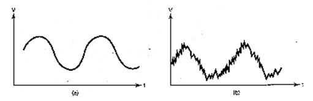

# PLAN LECTOR 
##  "Electrónica digital: qué es y características"
+ **¿Qué es la electrónica digital?**
  
Es una rama de la electronica que trabaja con señales discretas, es decir que trabaja con un número limitado de valores o posiciones, el 0 y el 1 ( siendo 0 cuando el circuito esta apagado y 1 cuando esta encendido )

+ **¿En qué se basa el funcionamiento de la electrónica digital?**

  

+ **¿Qué ventajas nos ofrece la electrónica digital?**

Usa el sistema binario ( conjunto de ceros y unos), no le afecta el ruido electrico (pero si que lo provoca cuando hay multiples dispositivos), cuenta con una capacidad de almacenamiento muy grande que puede procesar,

+ **¿Por qué no le afecta el ruido eléctrico? ¿Puede originar ruido eléctrico? ¿Qué problemas origina esto?**
  
Debido a que la electronica digital consiste en ceros y unos el ruido electrico poco puede interferir en este sistema biposicional, pero son quienes causan más ruido eléctrico haciendo que algunas de las 

 

 

+ **Pensando en nuestro día a día, ¿dónde crees que se estás usando la electrónica digital?**

---

## Tecnología Agrícola Inteligente con Arduino

+ **¿Cómo podemos aplicar la placa de Arduino al control automático de la agricultura?**
  
1.-**Sensores y Monitoreo**:Sensores de humedad del suelo, temperatura, humedad atmosférica, y otros parámetros pueden conectarse a placas Arduino. Estos sensores proporcionan datos en tiempo real que permiten a los agricultores tomar decisiones informadas sobre el riego, la fertilización y otros aspectos del cultivo.(TELECOGAMES)

2.-**Automatización**:Utilizando sensores para medir la humedad del suelo, Arduino puede activar o desactivar válvulas de riego para asegurar que las plantas reciban la cantidad adecuada de agua.

3.-**Invernaderos Inteligentes**: Sensores de temperatura, humedad y luz conectados a Arduino pueden controlar automáticamente la ventilación, la calefacción y la iluminación para crear un ambiente óptimo para el crecimiento de las plantas.

4.-**Drones Agrícolas**: Arduino se utiliza en la construcción de drones agrícolas para realizar mapeo aéreo, monitoreo de cultivos y análisis de salud de las plantas. Los datos recopilados por los drones pueden ayudar a identificar áreas con problemas y optimizar las prácticas agrícolas.

5.-**Sistemas de Alimentación Automática**: En la cría de animales, puede ser utilizado para controlar sistemas de alimentación automática. Esto garantiza que los animales reciban la cantidad adecuada de alimento en momentos específicos, mejorando la eficiencia de la alimentación y reduciendo el desperdicio.

6.-**Control de Plagas**: Sensores de movimiento y cámaras conectados a Arduino pueden utilizarse para detectar la presencia de plagas. Esto permite a los agricultores tomar medidas preventivas o correctivas de manera oportuna.

7.-**Comunicación y Monitoreo Remoto**: Arduino puede ser integrado con módulos de comunicación para enviar datos a la nube. Esto posibilita que los agricultores monitoreen y controlen sus cultivos de manera remota, recibiendo alertas y actualizaciones en tiempo real.

+ **¿Cómo podemos incorporar la placa de Arduino para controlar los datos de nuestro prototipo de invernadero en el aula?**

Dentro de nuestras necesidades y capacidades, podemos implementar los **_1.Sensores de monitoreo, 2.Automatización, posiblemente 3.Invernadero inteligente y 7.Comunicación y monitoreo remoto_** 
  
+ **¿De qué manera lo puedes hacer?**
  En clase estamos trabajando en alguno de estos aspects, la ejecución sería:
**1.-Sensores de monitoreo:** ya hemos estado trabajando en la 

  
  
