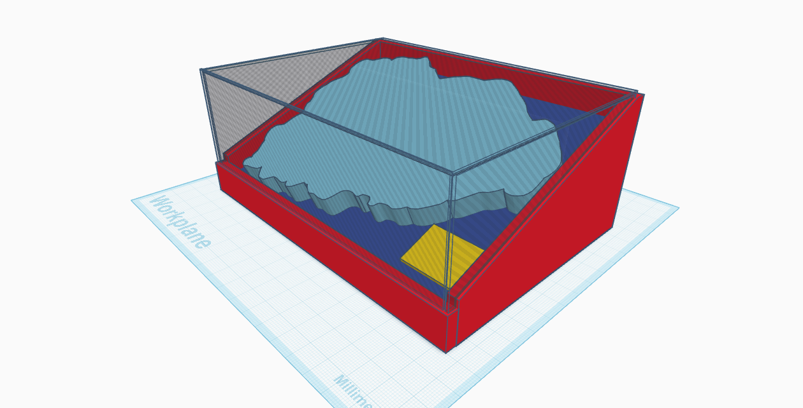
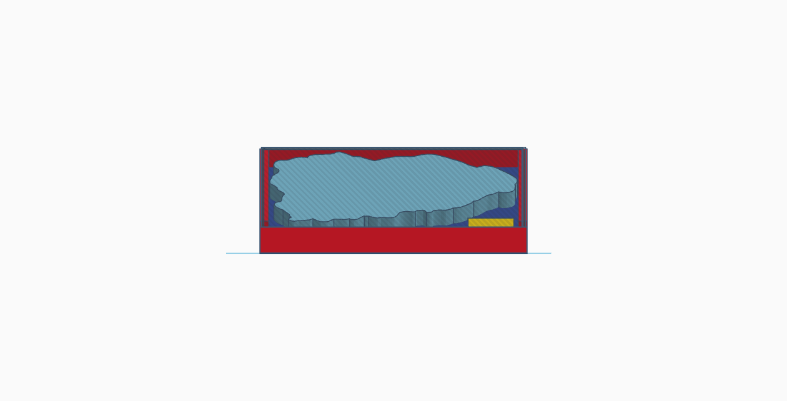
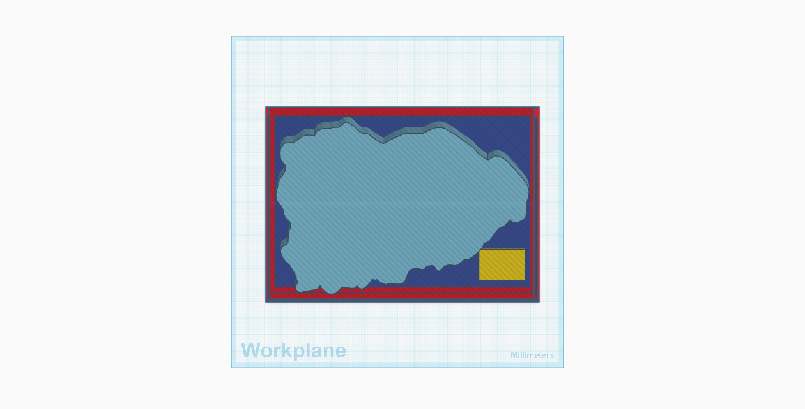

# TECNOLOGÍA
Cuaderno de clase 2025-2026 4º ESO

# Proyecto #1: Implementación del Mapa en el Centro
El objetivo de este proyecto es de implementa el mapa de Jaén que fue usado en el proyecto * _Andalucía en un Mapa Tecnológico_ * en algun lugar del centro, a la vista de cualquiera que pase

## Idea#1
La idea que propongo es situar el mapa, utiizando las mesas que hay bajo las escaleras que estan al lado de secretaria, crear una vitrina donde poder situar el mapa adentro en diagonal para tener una mejor visión de este.

  

Diseño en tikercad:

   
 PERSPECTIVA/ALZADO

  
       

   
PERFIL/PLANTA

  
       

 
 
## Materiales
Para poder llevar a cabo este proyecto necesitamos una serie de materiales que podemos _reciclar del centro o de las casas del alumnado_ o bien _comprado los materiales_.
Los materiales necesarios serían:
+ **2 Mesas de madera (o tablones)** que serviran para hacer la estructura de la vitrina (rojo,azul)
+ Para el cuadro informativo (*amarillo*) podria servir otra tabla y pegar una pegatina con la informacion o directamente poner la pegatina con el qr a la pagina.
+ **Metracrilato** (gris)
+ ***Clavos,soportes, varillas***, cualquier material que pueda sugetar el mapa y mantenerlo firme y que pueda ser extraido para su mantenimiento.

# Proyecto #2: Rescate del invernadero
Nuesto objetivo para este proyecto es la de rescatar la zona del invernadero y el inverndero, lo que incluye *arreglarla/reformarla*, *darle un uso*, y *mantenimiento*.
## ESTADO DEL INVERNADERO
El invernadero presenta bastantes daños como son agujeros en el agrofilm (plastico del invernadero) ,un boquete en el suelo, estructuras caidas y oxido, pero no tan solo daños materiales, tambien nos enfrentamos a una tierra seca donde si queremos plantar algo vamos a necesitar de mucha agua, papel de cocina, estiercol y un milagro, a menos que cambiemos la tierra.

**-FOTOS**
      
