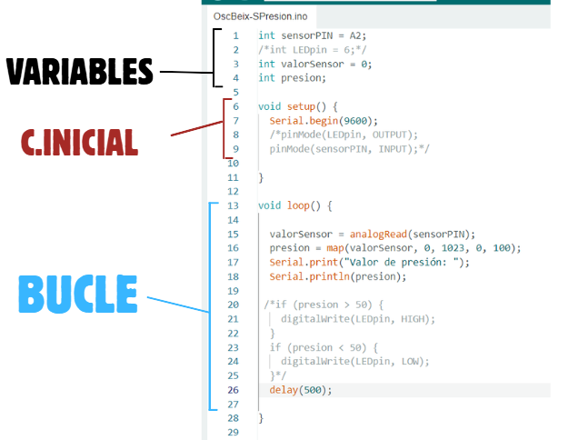
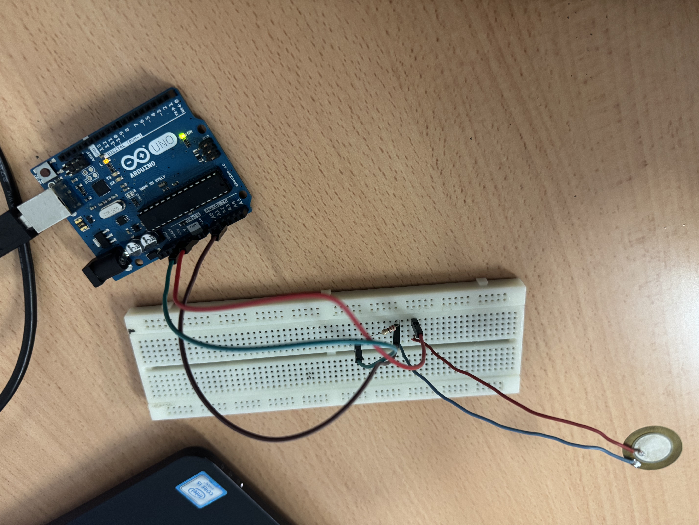

# TELECOGAMES
## Prueba de sensores
### LDR
### Sensor de presión

En nuestro projecto necesitaremos un encargado de asegurar que la puerta del invernadero este cerrada para proceder sin riesgo con las tareas de regado, para ello usaremos un **sensor de presión.**

- **¿Como funciona?**

El sensor de presión actua dando valores según la fuerza que se le es aplicada.
 _Los valores pueden variar segun que valores asignemos en arduino:**(variable nombre) = map([variable numérica],0, 1023,0, número)**_

- **Funcionamiento del circuito**
  
|arduino|montaje|
|---|---|
|| |

|parte|funcionamiento|
|---|---|
|| Antes de empezar con el circuito establecemos unas variables que usaremos más adelante:**_sensorPin=A2**_ ---> entrada de el sensor de presión   **_valorSensor=0_** --> variable numérica que usaremos para representar el componente analógico|
|| Iniciamos el circuito indicando la velocidad de transmisión (**Serial.begin(_1-9600_)**) en 9600 baudios (bits por segundos). |
|| Crearemos un bucle donde tomaremos la variable "_valorSensor_" el valor analógico resultante de la variable "presión", que es el sensor (**valorSensor = analogRead(presión)**). Seguimos con una linea de codigo que hará que "valorSensor" se exprese de 0 a 100 y el valor que de será en la variable "presión" el cual imprimiremos ambos el la pantalla (**presion=map...Serial.print(presion)**) para que no este imprimiendo valores a lo loco añadiremos un retraso de 0,5 segundo para que mande el valor a la pantalla (**delay(500)**).|

 
 |VIDEO DEL FUNCIONAMIENTO DEL CIRCUITO|
 |---|
 |   |

 
### Sensor de humedad

Otro encargado importante de asegurar que la tierra del invernadero este humedad para para poder controlar el crecimiento de la planta mediante la calidad del suelo, para ello usaremos un **sensor de humedad.**

- **¿Como funciona?**

El sensor de presión actua dando valores según la fuerza que se le es aplicada.
 (_Los valores pueden variar segun que valores asignemos en arduino:**(variable nombre) = map([variable numérica],0, 1023,0, número)**_)

- **Funcionamiento del circuito**
  
|arduino|montaje|
|---|---|
|| |

|parte|funcionamiento|
|---|---|
|| Antes de empezar con el circuito establecemos unas variables que usaremos más adelante:**_sensorPin=A2**_ ---> entrada de el sensor de presión   **_valorSensor=0_** --> variable numérica que usaremos para representar el componente analógico|
|| Iniciamos el circuito indicando la velocidad de transmisión (**Serial.begin(_1-9600_)**) en 9600 baudios (bits por segundos). |
|| Crearemos un bucle donde tomaremos la variable "_valorSensor_" el valor analógico resultante de la variable "presión", que es el sensor (**valorSensor = analogRead(presión)**). Seguimos con una linea de codigo que hará que "valorSensor" se exprese de 0 a 100 y el valor que de será en la variable "presión" el cual imprimiremos ambos el la pantalla (**presion=map...Serial.print(presion)**) para que no este imprimiendo valores a lo loco añadiremos un retraso de 0,5 segundo para que mande el valor a la pantalla (**delay(500)**).|

 
 |VIDEO DEL FUNCIONAMIENTO DEL CIRCUITO|
 |---|
 |   |

### Sensor PIR

