# TELECOGAMES
## Prueba de sensores

---
### LDR

El sensor **LDR** es el encargado de controlar la cantidad de luz que recibe el invernadero para saber si es de dia o de noche.

- **¿Como funciona?**

El sensor LDR actua dando valores según la luz que reciba de la parte superior (hay que tener en cuenta que la sombra de alguna hoja o otro objeto del entorno puede alterar).
 (_Los valores pueden variar segun que valores asignemos en arduino:**(variable nombre) = map([variable numérica],0, 1023,0, número)**_)

- **Funcionamiento del circuito**
  
|arduino|montaje|tinkercad|
|---|---|---|
| |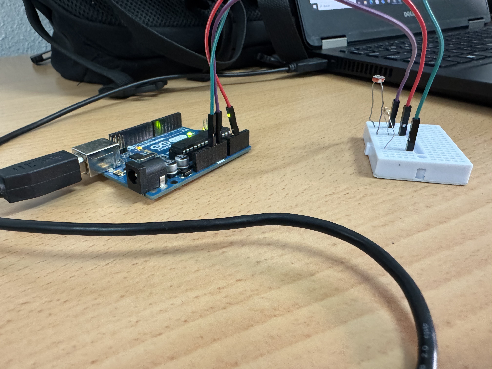 | 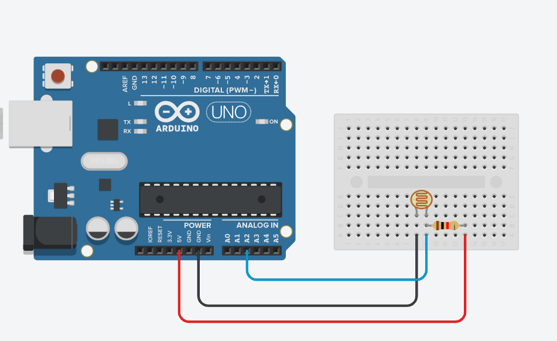 |

|parte|funcionamiento|
|---|---|
|| Antes de empezar con el circuito establecemos unas variables que usaremos más adelante:**_sensorPin=A2**_ ---> entrada de el sensor de presión   **_sensor y cantidadluz_** --> variables numérica que usaremos para representar el componente analógico |
|| Iniciamos el circuito indicando la velocidad de transmisión (**Serial.begin(_1-9600_)**) en 9600 baudios (bits por segundos). |
|| Crearemos un bucle donde tomaremos la variable "_sensor_" como valor analógico de _"sensorPin"_, que es el sensor (**sensor = analogRead(sensorPin)**). Seguimos con una linea de codigo que hará que "cantidadluz" se exprese de 0 a 100 y el valor que de será en la variable "sensor" el cual imprimiremos ambos el la pantalla (**cantidadluz=map...Serial.print(sensor)**) para acabar añadiremos un retraso de 0,5 segundo para que mande el valor a la pantalla (**delay(500)**).|

 
 |VIDEO DEL FUNCIONAMIENTO DEL CIRCUITO|
 |---|
 |   |

---

### Sensor de presión

En nuestro projecto necesitaremos un encargado de asegurar que la puerta del invernadero este cerrada para proceder sin riesgo con las tareas de regado, para ello usaremos un **sensor de presión.**

- **¿Como funciona?**

El sensor de presión actua dando valores según la fuerza que se le es aplicada.
 _Los valores pueden variar segun que valores asignemos en arduino:**(variable nombre) = map([variable numérica],0, 1023,0, número)**_

- **Funcionamiento del circuito**
  
|arduino|montaje|tinkercad|
|---|---|---|
|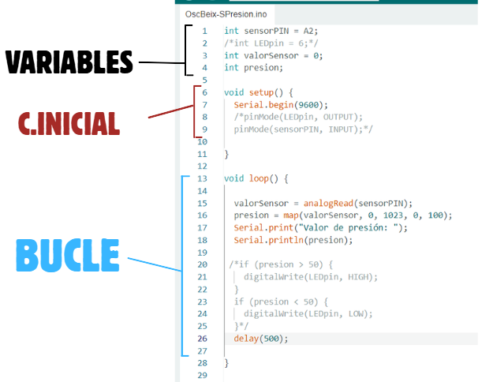|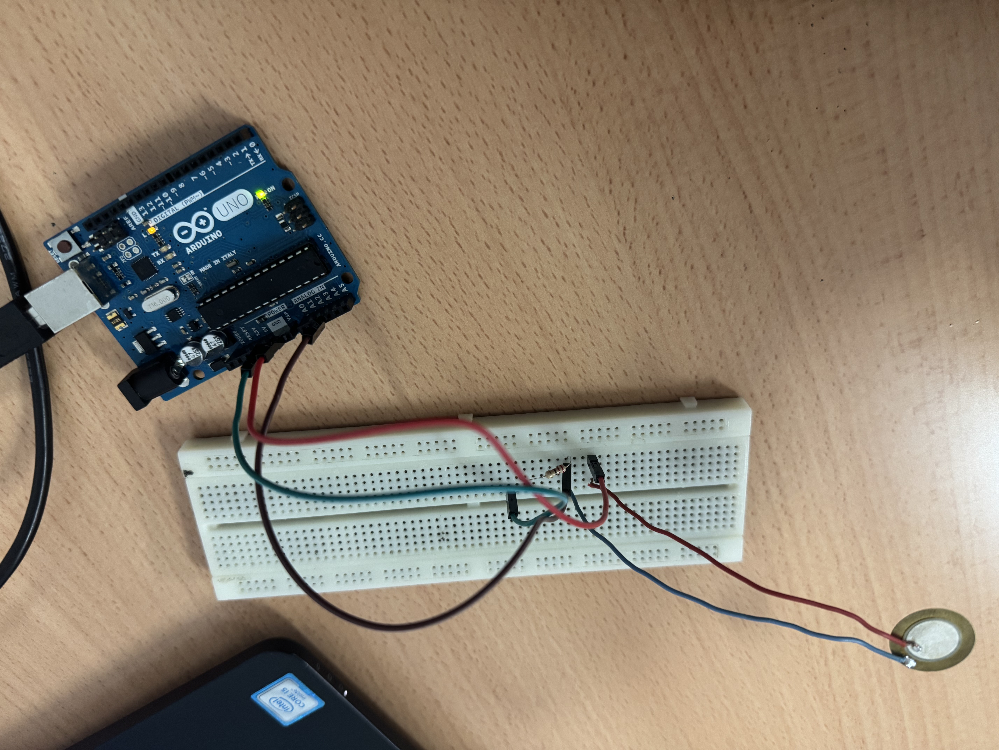 |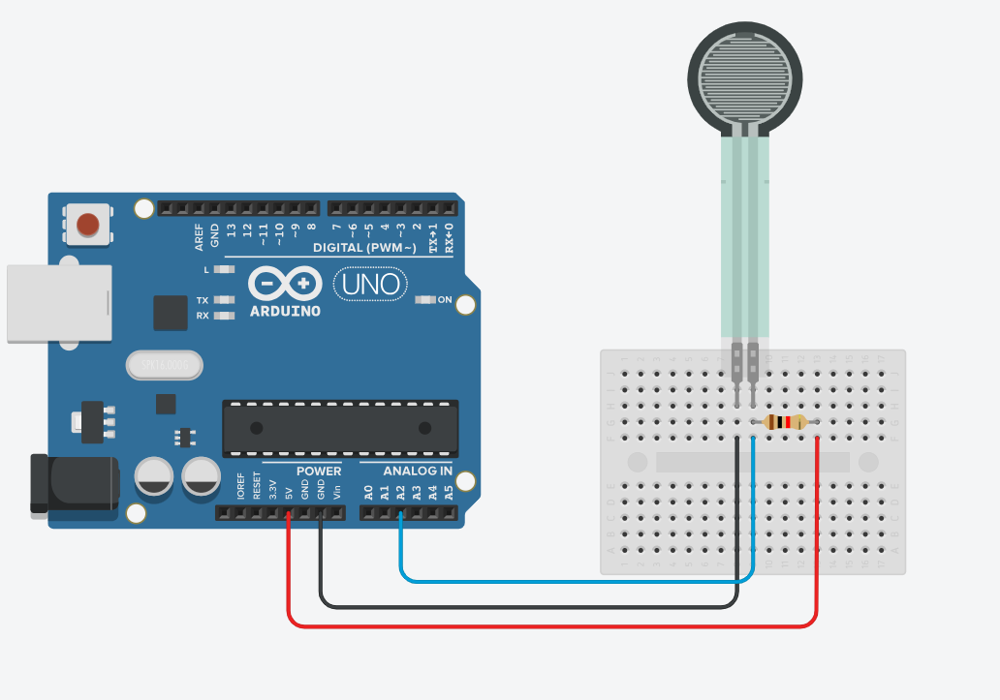|

|parte|funcionamiento|
|---|---|
|| Antes de empezar con el circuito establecemos unas variables que usaremos más adelante:**_sensorPin=A2**_ ---> entrada de el sensor de presión   **_valorSensor=0_** --> variable numérica que usaremos para representar el componente analógico|
|| Iniciamos el circuito indicando la velocidad de transmisión (**Serial.begin(_1-9600_)**) en 9600 baudios (bits por segundos). |
|| Crearemos un bucle donde tomaremos la variable "_valorSensor_" el valor analógico resultante de la variable "presión", que es el sensor (**valorSensor = analogRead(presión)**). Seguimos con una linea de codigo que hará que "valorSensor" se exprese de 0 a 100 y el valor que de será en la variable "presión" el cual imprimiremos ambos el la pantalla (**presion=map...Serial.print(presion)**) para que no este imprimiendo valores a lo loco añadiremos un retraso de 0,5 segundo para que mande el valor a la pantalla (**delay(500)**).|

 
 |VIDEO DEL FUNCIONAMIENTO DEL CIRCUITO|
 |---|
 |   |

---

### Sensor de humedad

Otro encargado importante de asegurar que la tierra del invernadero este humedad para para poder controlar el crecimiento de la planta mediante la calidad del suelo, para ello usaremos un **sensor de humedad.**

- **¿Como funciona?**

El sensor de presión actua dando valores según la humedad que percibaaltacto de sus dos salientes metálicos.
 (_Los valores pueden variar segun que valores asignemos en arduino:**(variable nombre) = map([variable numérica],0, 1023,0, número)**_)

- **Funcionamiento del circuito**
  
|arduino|montaje|tinkercad|
|---|---|---|
|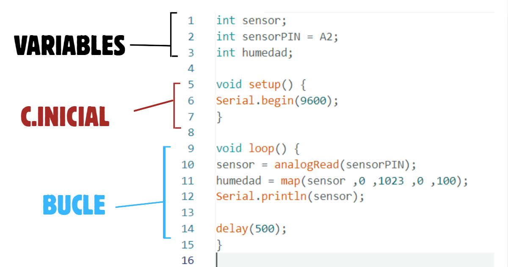| | 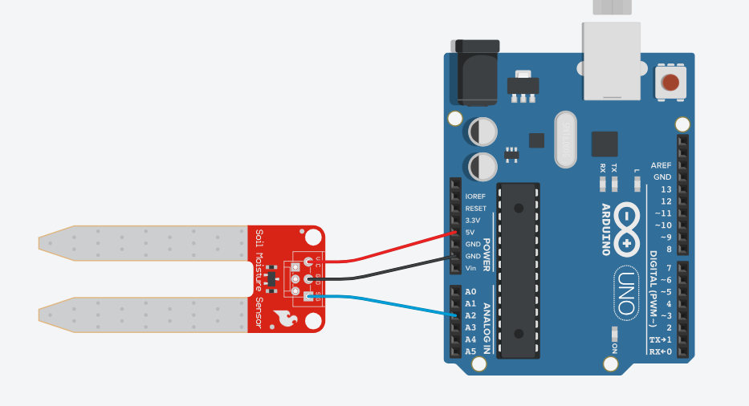 |

|parte|funcionamiento|
|---|---|
|| Antes de empezar con el circuito establecemos unas variables que usaremos más adelante:**_sensorPin=A2**_ ---> entrada de el sensor de presión   **_valorSensor=0_** --> variable numérica que usaremos para representar el componente analógico|
|| Iniciamos el circuito indicando la velocidad de transmisión (**Serial.begin(_1-9600_)**) en 9600 baudios (bits por segundos). |
|| Crearemos un bucle donde tomaremos la variable "_valorSensor_" el valor analógico resultante de la variable "presión", que es el sensor (**valorSensor = analogRead(presión)**). Seguimos con una linea de codigo que hará que "valorSensor" se exprese de 0 a 100 y el valor que de será en la variable "presión" el cual imprimiremos ambos el la pantalla (**presion=map...Serial.print(humedad)**) para que no este imprimiendo valores a lo loco añadiremos un retraso de 0,5 segundo para que mande el valor a la pantalla (**delay(500)**).|

 
 |VIDEO DEL FUNCIONAMIENTO DEL CIRCUITO|
 |---|
 |   |

---

### Sensor de temperatura

Para asegurar que la temperatura del invernadero este en las conciciones optimas de la planta que vayamos a cosechar y evitar que se llegue a secar, usaremos un **sensor de temperatura.**

- **¿Como funciona?**

El sensor de temperatura mide valores según la temperatura que perciba de su entorno.
 (_Los valores pueden variar segun que valores asignemos en arduino:**(variable nombre) = map([variable numérica],0, 1023,0, número)**_)

- **Funcionamiento del circuito**
  
|arduino|montaje|tinkercad|
|---|---|---|
||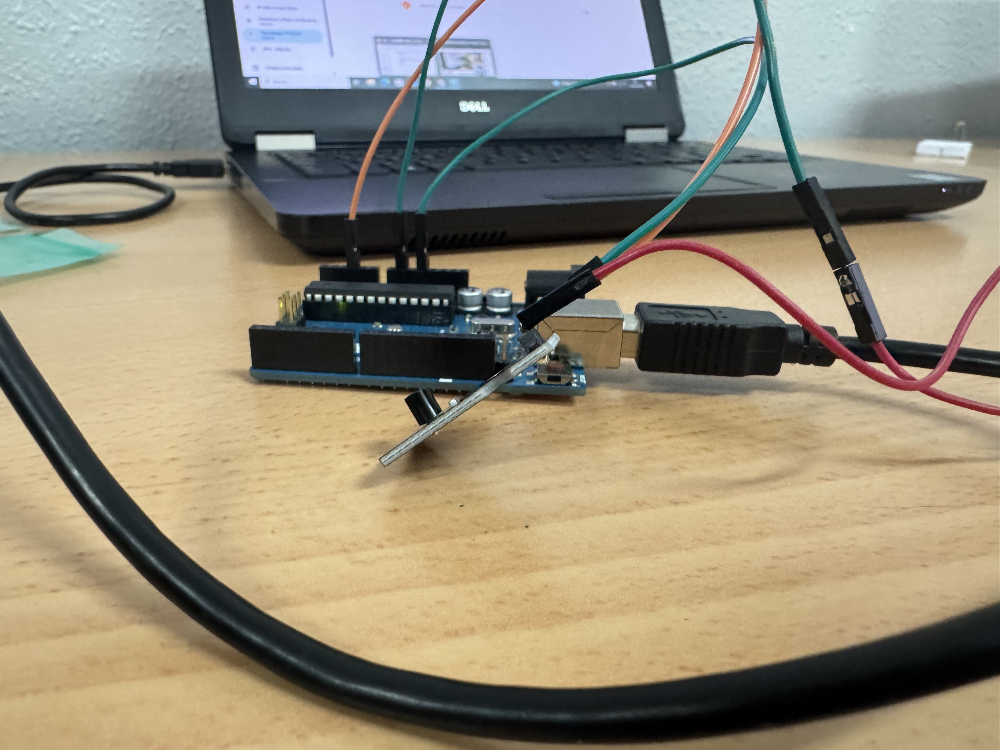 | 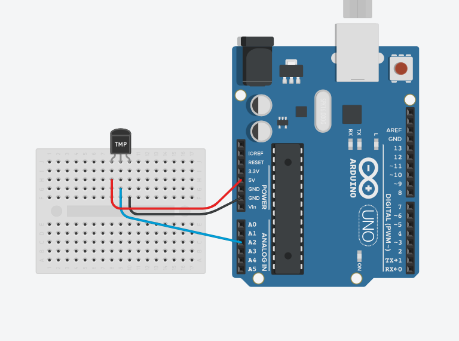 |

|parte|funcionamiento|
|---|---|
|| Antes de empezar con el circuito establecemos unas variables que usaremos más adelante:**_sensorPin=A2**_ ---> entrada de el sensor de presión   **_valorSensor=0_** --> variable numérica que usaremos para representar el componente analógico|
|| Iniciamos el circuito indicando la velocidad de transmisión (**Serial.begin(_1-9600_)**) en 9600 baudios (bits por segundos). |
|| Crearemos un bucle donde tomaremos la variable "_valorSensor_" el valor analógico resultante de la variable "humedad", que es el sensor (**valorSensor = analogRead(temperatura)**). Seguimos con una linea de codigo que hará que "valorSensor" se exprese de 0 a 100 y el valor que de será en la variable "temperatura" el cual imprimiremos ambos el la pantalla (**presion=map...Serial.print(temperatura)**) para que no este imprimiendo valores a lo loco añadiremos un retraso de 0,5 segundo para que mande el valor a la pantalla (**delay(500)**).|

 
 |VIDEO DEL FUNCIONAMIENTO DEL CIRCUITO|
 |---|
 |  |

### sensor

### Sensor PIR

## DISEÑO DEL INVERNADERO (MAQUETA)
### PROPUESTAS
 Pasamos a montar la maqueta de la estructura que va a contener todos los componentes, para ello pasamos con nuestra "lluvia de ideas" donde podemos dividir las ideas en **tipo de unión** y **tipo de base**.

 

 
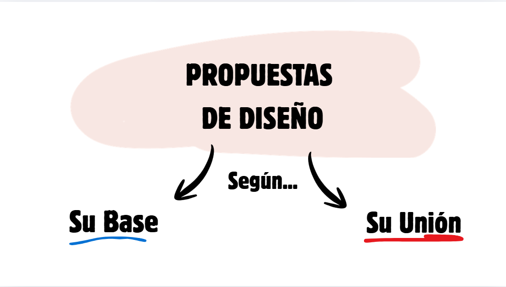

Vamos a aclarar todas las propuestas y veremos sus ventajas y desventajas que aporten.

#### Según su base

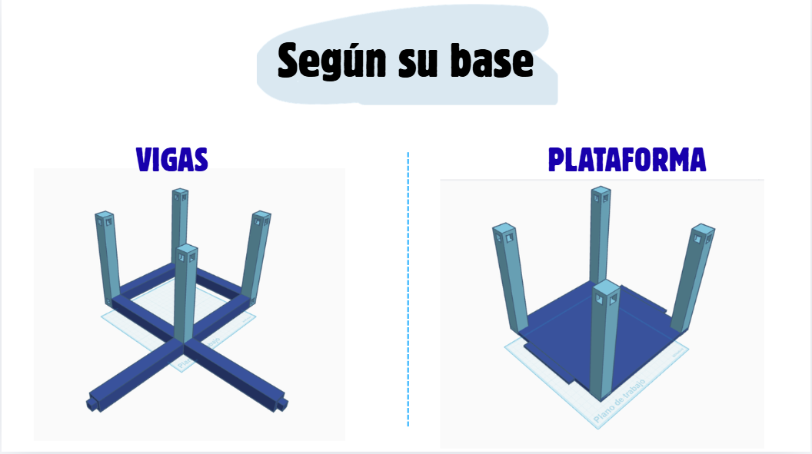

 |**tipo**|**descripción**|||
 |---|---|---|---|
 || En esta estructura usamos las vigas que hemos usado para el techo con suelo| Al ser hueco tiene menos peso y tiene una unión fuerte| Sacrificamos 4cm de altura (-22,22%)|
 || Usamos planchas que se conectan entre si para sostener las columnas| perdemos menos altura (-2cm), facil de llevar y montar |Tener que crear un diseño único de cada plataforma (no son iguales)  |

#### Según su unión

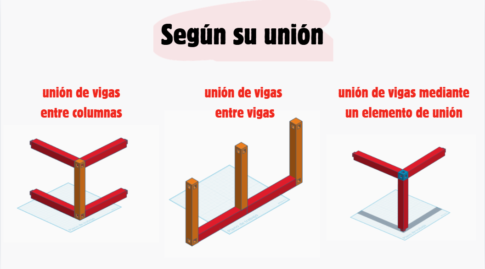

 |**tipo**|**descripción**|||
 |---|---|---|---|
 || En esta red de vigas se unen vigas entre columnas que actuan como nexos | diseño simple no hace falta crear muchos diseños | pocos o ninguno (precisión en los salientes y huecos.)|
 || aqui unimos vigas entre vigas en los estremos pero no en las esquinas, las vigas tienen un agujero donde intecalar la columna| no perdemos altura |tenemos que diseñar muchas piezas diferentes, se pierde anchura y largo a comparacion de los demás tipos de unión|
  ||En esta estructura unimos vigas a unos elementos de unión huecos asi las vigas actuando tambien como columnas | solo necesitamos 2 diseños | Su estructura es débil asi que se puede caer o doblar |

### Diseño final

El diseño que acabamos utilizando para la maqueta del invernadero es la de una **losa continua** con laque los pilares estaban insertados, manteniendose en pie gracias a la unión de vigas entre ellas.

 

 

## 3.PROGRAMA Y 4.MONTAJE
### 3.1 Programa bluetooth
Uno de los requisitos que nos aplica el programa _Telecogames_ es la implementacion de una conexión entre 2 placas de Arduino (_medio de comunicación_). En nuestro proyecto ibamos usar una conexión via WiFi pero acabamos usando una conexión **Bluetooth**, ya que la via WiFi tratamos de conectarla a Andared pero estaba tapada, impidiendonos establecer el medio de comunicación de ambas placas.
 |**programa**|**descripción**|
|---|---|
|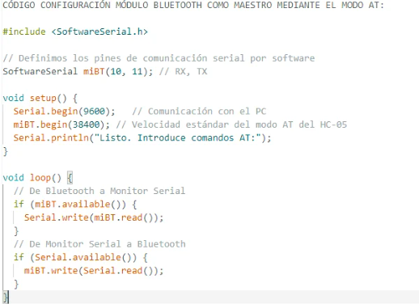||

+ _**conf. bluetooth**_

 
+ _**ciberseguridad**_
Otro requisito de Telecogames es establecer un tipo de ciberseguridad para impedir de alguna manera la entrada de terceros al programa. Nosotros usamos una muy basica con la direccion MAC:

 |**¿Qué es la dirección MAC?**|**Foto de dirección MAC**|
|---|---|
|   |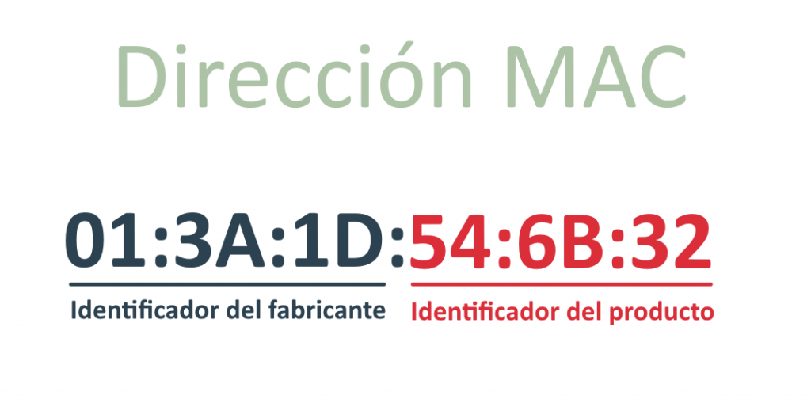|

### 3.2 Programa maestro

|**programa**|**descripción**|
|---|---|
|||

### 3.3 Programa esclavo
El programa esclavo es el encargado de recibir las señales del maestro y encender los LEDs 

|**programa**|**descripción**|
|---|---|
|||

### 4.1 Montaje del invernadero

